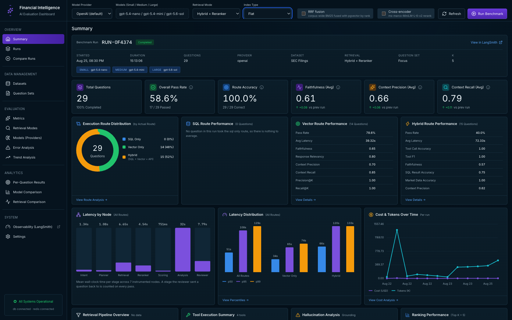
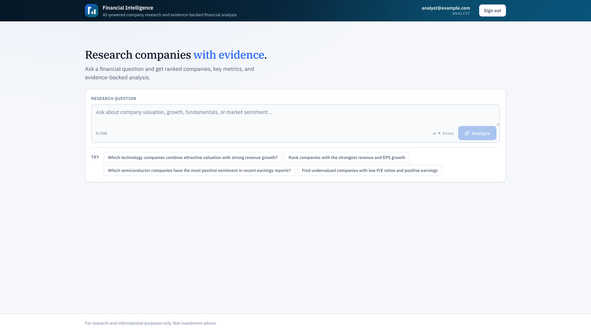
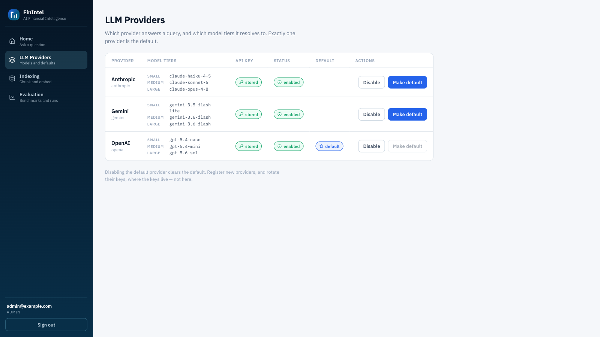
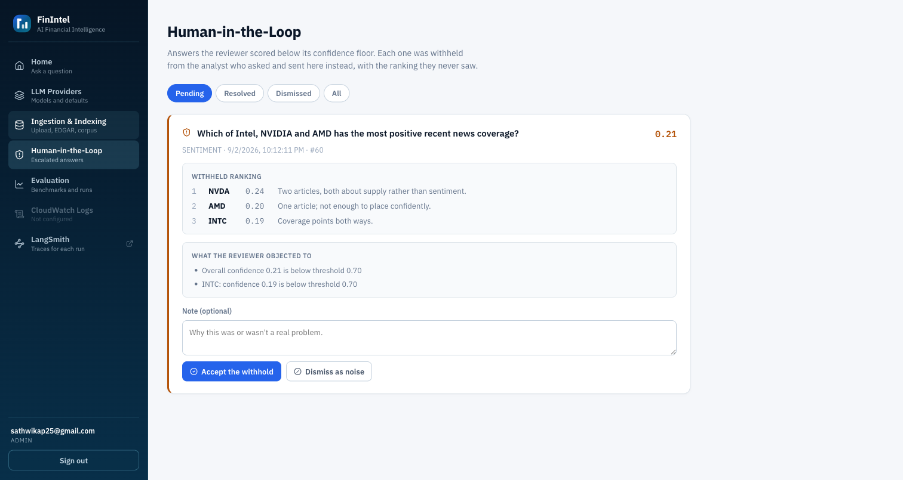
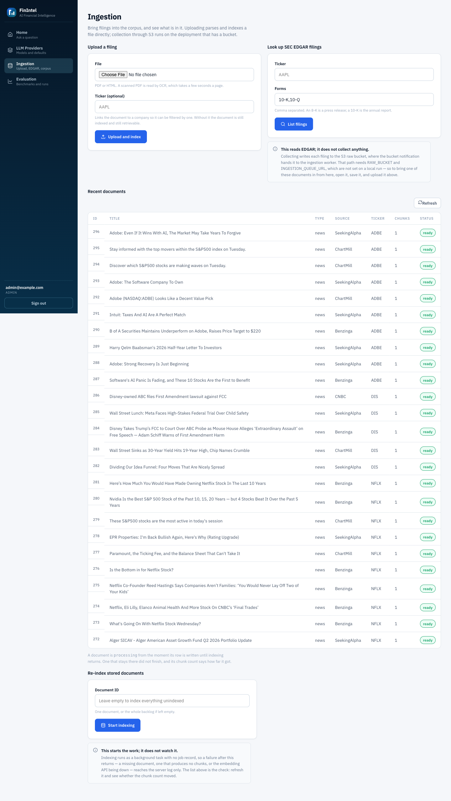

# Financial Intelligence Pipeline

A FastAPI + LangGraph service that answers natural-language financial questions by routing them across **SQL** (structured company and financial data), **vector/RAG retrieval** (news, filings, earnings coverage), and **live market data**, then scores, ranks and synthesizes the results into a cited report that a reviewer node fact-checks before it is returned.

Around that pipeline sit the parts that make its quality measurable: a 100-question benchmark with versioned ground truth, RAGAS and custom evaluators, a claim-level audit, an escalation path for low-confidence answers, and a dashboard for reading the results.



## Contents

- [Screens](#screens)
- [Architecture](#architecture)
- [Deployment modes](#deployment-modes)
- [Request flow](#request-flow)
- [API reference](#api-reference)
- [Data model](#data-model)
- [Evaluation](#evaluation)
- [Security](#security)
- [Benchmark results](#benchmark-results)
- [Benchmark reproducibility](#benchmark-reproducibility)
- [Deployment](#deployment)
- [Project layout](#project-layout)
- [Engineering notes](#engineering-notes)
- [Source availability](#source-availability)

## Screens

**The query console.** One question in, a ranked and cited answer out. Length is
bounded at 500 characters; the suggestions are the four intents the router
recognises.



**Provider and model configuration.** Models are not hardcoded — providers and
their small/medium/large tiers live in the database, with API keys stored
encrypted. This is what lets the same code run against a metered provider
locally and a free-tier one publicly.



**Human review.** Answers the reviewer node could not approve are queued here
rather than shown to the reader as reviewed.



**Ingestion.** Upload and EDGAR collection, with one event row per attempt —
including the attempts that produced no document.



## Architecture

The system is a set of **LangGraph state graphs** orchestrating LLM calls, tool use and retrieval:

```
                   ┌──────────────────────────────────────────┐
                   │              financial_graph             │
                   │      (backend/graph/financial_graph.py)  │
                   └──────────────────────────────────────────┘

  intent → planner → retrieval → scoring → analysis → reviewer ──┐
                        ▲                                        │
                        └────────── retry (should_retry) ────────┘
                                                                 │
                                                                 ▼
                                                                END
```

- **intent_node** — classifies the query into `VALUATION | GROWTH | SENTIMENT | MIXED` (small tier, structured output).
- **planner_node** — decomposes the query into `sql_query`, `vector_query`, `market_query` (tickers) and a `strategy` (`PARALLEL` / `SQL_FIRST` / `VECTOR_FIRST`).
- **retrieval** — an async node wrapping `hybrid_retrieve_async`. Intent-based branching happens here, not at the graph-edge level.
- **scoring_node** — reranks retrieved companies (`backend/scoring/ranker.py`), attaches evidence and explainability.
- **analysis_node** — synthesizes a structured report with per-company recommendations and cited evidence (large tier).
- **reviewer_node** — fact-checks the draft against its evidence (confidence thresholds, missing evidence, citation validation, hallucination check) and either approves it as `final_report` or loops back to retrieval, up to 3 retries before force-passing.

`market_node`, `sql_node`, `vector_node` and `reranker_node` provide the single-source work the retrieval stage composes. Two sub-graphs implement single-source retrieval as **ReAct tool-calling agents** and are exposed on their own routes in `full` mode:

- **`sql_graph.py`** — an LLM bound to SQL tools (schema lookup, query generation, validation, execution, error-fix) looping against `tools` until done or 3 failed fix attempts.
- **`vector_graph.py`** — an LLM bound to a single `retrieve_similar` tool.

### Hybrid retrieval

`backend/retrieval/hybrid_retrieval.py` fans work out based on intent:

| Intent | Sources | Weights |
|---|---|---|
| `VALUATION` / `GROWTH` | SQL only | SQL 100% |
| `SENTIMENT` | Vector only | Vector 100% |
| `MIXED` | SQL + Vector + Market, in parallel | SQL 40 / Vector 30 / Market 30, redistributing to 60/40 when market data is unavailable |
| `OUT_OF_SCOPE` | none — the graph exits at the classifier | — |

`VALUATION` and `GROWTH` are answered from columns, so the reviewer accepts the metrics table as evidence for them. Requiring a document chunk to support a database fact is the same error the retrieval-precision metric made, and it turned every numeric question into a refusal. Narrative intents still require a retrieved document, and no evidence at all remains a failure for every intent.

Per-source timeouts are SQL 45s, Vector 10s, Market 8s, with a 60s ceiling on the `MIXED` fan-out and graceful degradation on partial failure. `combine_results()` derives an `overall_confidence` from whichever sources actually returned.

### The retrieval stack

Vector search is two-stage by default. A raw pgvector cosine query over `document_chunks` pulls `top_k × 4` candidates, which `rank_bm25.BM25Plus` then reranks against LLM-extracted financial keywords. Two further stages exist behind per-run flags and are **off by default**:

| Stage | Module | Default | Cost |
|---|---|---|---|
| pgvector ANN | `vector_search.py` | always | a query |
| BM25 **rerank** | `vector_search.py` — `bm25_rerank()` | always | pure Python |
| BM25 **corpus-wide** + reciprocal rank fusion | `lexical_search.py` + `fusion.py` | off | an in-memory index; fusion is `1/(60 + rank)` |
| Cross-encoder rerank | `cross_encoder.py` | off | loads torch, ~270 MB, plus per-query inference |

There are two distinct BM25 stages and they are easy to confuse. `bm25_rerank` reorders what pgvector already returned, so it can only change the order of that list. `search_chunks_lexical` ranks the *whole* corpus independently, which is what reciprocal rank fusion needs — fusing two lists that cannot disagree adds nothing.

Those flags are set per benchmark run, which is what they were built for: they make retrieval variants measurable against the same questions. A live query sets none of them and runs the baseline.

Query embeddings are cached in Redis for 30 days, keyed on a SHA-256 of `(model, exact text)`. The key is deliberately exact rather than semantic — the benchmark contains near-identical questions like *"the 5 companies with the strongest revenue growth"* and *"the 10"*, which differ by one digit and have different correct answers.

### Scoring and ranking

`backend/scoring/ranker.py` computes four normalized (0–1) dimension scores per company — **valuation** (P/E and price momentum), **growth** (revenue growth and EPS sign), **relevance** (mean chunk similarity) and **sentiment** (positive/negative term ratio in matched chunks) — combined with weights that shift according to which sources actually returned data, optionally blended 70/30 with an LLM holistic score.

`evidence_builder.py` attaches per-company citations (`NVDA-sql-1`, `NVDA-vector-2`, `NVDA-market-1`), and `score_normalizer.py` produces the explainability breakdown and recommendation bucket. Dimensions with no data are reported as `unmeasured` rather than scored as zero.

### Model configuration

Models are **not hardcoded**. Providers and their models live in the `llm_providers` and `llm_models` tables, and the pipeline asks for a tier — `small`, `medium` or `large` — rather than a model name. Provider API keys are stored Fernet-encrypted under `LLM_KEY_ENCRYPTION_SECRET`; nothing reads a provider key from the environment.

This is what lets the same code run against a metered provider locally and a free-tier one for a public deployment, where an unauthenticated endpoint makes a free tier the difference between a rate limit and a bill. The one exception is embeddings: `text-embedding-3-small` (1536-dim) via `OPENAI_API_KEY`, because not every provider offers an embeddings API.

## Deployment modes

`DEPLOYMENT_MODE` decides which routers are mounted, and the absence is the control — unlinking a route from the UI leaves it reachable, so a public deployment must not mount it at all.

| | `portfolio` | `full` |
|---|---|---|
| Auth | none — no login route is mounted | JWT, roles enforced per router |
| Mounted | the financial query endpoint, `/health` | everything |
| Absent | admin, indexing, ingestion, evaluation, claims, escalations, SQL and vector routes | — |
| Control on cost | per-IP rate limit | login |

`/health` reports `auth_required`, and the frontend reads it to decide whether to render a sign-in screen — rather than probing an auth route that may not exist.

### Environments

Mode and environment are related but not the same thing, and comments in this
repository name the environment whenever a number depends on it. There are three:

| | **local** | **preprod** | **production** |
|---|---|---|---|
| Purpose | development and the test suite | the public demo anyone can open | the deployment the infrastructure targets |
| Mode | `full` | `portfolio` | `full` |
| Host | docker compose | one managed web service | container orchestration |
| Size | your machine | **0.5 CPU / 512 MB**, one instance | task-sized, `desired_count = 1`, no autoscaling |
| Database | local Postgres + pgvector | managed Postgres | managed Postgres |
| Redis | compose service | managed | a sidecar container in the same task |
| Auth | login | none, by design | login |

**Most tight numbers in this repository are preprod numbers.** 512 MB, 0.5 CPU,
the daily token ceiling and the two-query concurrency bound all describe the
preprod deployment, because that is the constrained one and the one the public
can reach. Production sizing is Terraform's business and is set in
`infrastructure/production/`.

Two consequences worth stating, because they are easy to read the wrong way:

- **The concurrency bound and the rate limiter are process-local.** On preprod
  that is the true ceiling, because there is one instance. On production with
  more than one task they bound each task rather than the service, and the
  count belongs in Redis.
- **The EDGAR rate limiter has the same shape.** Its lock is per-process while
  the NAT gateway's address is shared, so it is correct at
  `desired_count = 1` and one Terraform line away from being silently wrong.

## Request flow

1. Client `POST`s a natural-language question to `/api/retrieve/financial`.
2. `intent_node` classifies it as `VALUATION`, `GROWTH`, `SENTIMENT`, `MIXED` or `OUT_OF_SCOPE`. The last exits here — a greeting is answered in about a second rather than researched for forty. `planner_node` splits the rest into per-source sub-queries.
3. `hybrid_retrieve_async` fans out to SQL, vector and market retrieval per the intent-weight table.
4. `scoring_node` ranks companies and attaches evidence.
5. `analysis_node` drafts a structured report citing that evidence.
6. `reviewer_node` fact-checks the draft. A retry goes back to **analysis**, not retrieval: by that point the query, the cohort and the corpus are fixed, so re-retrieving returns the same documents and raises the same flags. What can differ is the draft, because the rejected claims are handed to the analysis prompt.

A retry is also skipped when this attempt's feedback is identical to the last one's — the same flags produced the same draft once already.

The reviewer has four terminals: `approved`, `forced_pass` at the retry limit, and two that withhold the ranking rather than present it as reviewed — `withheld_review_unavailable` when the fact-checking model could not be reached, and `withheld_provider_unavailable` when the provider refused the analysis call. Those two exist because a transport failure is not a finding about the answer, and telling a reader "the reviewer raised 0 unresolved issues" while withholding their result is worse than telling them nothing.

## API reference

### Available in every mode

`POST /api/retrieve/financial`

```jsonc
// request
{ "query": "Compare valuation and sentiment for NVDA and AMD" }
// response
{ "query": "...", "final_report": { ... }, "result": { ... } }
```

Query length is bounded to 3–500 characters. In `full` mode this route requires the analyst role; in `portfolio` mode it is public and the rate limiter is the only ceiling.

`GET /health` — Postgres and Redis connectivity plus the deployment's auth posture: `{status, db, redis, auth_required}`. Redis reporting `error` is not fatal; every caller fails open.

### `full` mode only

| Prefix | Purpose |
|---|---|
| `POST /api/retrieve/sql` | SQL agent alone |
| `POST /api/retrieve/vector` | Vector/RAG agent alone |
| `POST /api/index/documents` | (Re)index one document or all unindexed ones, as a background task |
| `/api/ingestion` | Upload, EDGAR collection, ingestion job status and event log |
| `/api/evaluation` | Benchmark runs, metrics, per-question results, claim audit |
| `/api/auth` | Sign-in, token issue, current user |
| `/admin/llm` | Provider and model configuration |
| `/admin/escalations` | Low-confidence answers queued for human review |
| `/admin/security` | Security event feed |
| `/api/admin` | External console links |

## Data model

Postgres with pgvector, via SQLAlchemy (`backend/models/db_models.py`). 23 tables:

**Corpus and reference**
`companies`, `financial_metrics`, `documents`, `document_chunks` (a `Vector(1536)` column — chunk-level, after embeddings were migrated off `documents`), `themes`, `company_themes`.

**Configuration**
`llm_providers` (encrypted keys, a partial unique index enforcing at most one default), `llm_models` (one model per provider per tier), `users`.

**Evaluation**
`benchmark_runs`, `evaluation_metrics`, `question_results`, `claim_evaluations`, `escalations`.

**Operations**
`ingestion_events` (one row per attempt, including the attempts that produced no document — duplicates, unreadable PDFs), `system_logs`, `retrieval_logs`, `retrieved_evidence`, `model_costs`, `alembic_version`.

### A note on migrations

Two things write this schema: SQLAlchemy's `create_all` in the app lifespan, and Alembic's 23 revisions. The Alembic chain begins at *"add embedding column to documents"* — it **alters** base tables rather than creating them, because those tables already existed when the chain started.

So `alembic upgrade head` is only correct against a database Alembic has already seen. On an empty database it fails on a table that does not exist yet. `backend/startup_migration.py` decides which case applies by looking for the version table, and stamps rather than replays when the schema came from the models. Use it instead of calling Alembic directly.

## Evaluation

100 golden questions, split 30 valuation / 30 growth / 25 sentiment / 15 mixed, plus a 4-question `smoke` set and an env-driven `focus` set for iterating on specific questions.

Ground truth is maintained in two halves for a reason:

- **Derived** — the 60 valuation and growth questions are generated from specifications in `question_bank.py` by querying the seeded database. Never hand-edited; regenerate after every reseed.
- **Authored** — the sentiment and mixed questions carry reference answers and reference contexts written by a human. A model-written reference would only confirm the model's own output.

**Reseeding invalidates all of it.** The seed pulls live fundamentals, so market caps and P/E ratios move and the membership of a "top five" can change outright — one reseed dropped NVDA out of the five smallest technology market caps and brought CRM in. The pipeline then answers correctly and the benchmark marks it wrong, which looks exactly like a regression. This is what the [frozen snapshot](#seeding-and-the-frozen-snapshot) exists to prevent.

Beyond RAGAS, a **claim audit** extracts individual factual claims from an answer and checks each against the retrieved evidence, so an answer that is right overall but unsupported in one sentence is visible as such.

### What the database records, and what LangSmith does

Three systems observe a run and the split between them is deliberate.

**LangSmith owns the trace hierarchy.** LangGraph opens one run per registered
node and the retrieval branches carry `@traceable` — 57 instrumented spans. For
inspecting a single query after the fact, nothing here competes with it, and
`observability/tracing.py` deliberately avoids adding a second span per node.

**The database keeps what has to be joined or aggregated.** *"p95 latency for
withheld answers on healthcare questions last week"* needs traces joined to
decisions and to the corpus; that is one SQL query and an export-and-spreadsheet
exercise anywhere else. It also survives a third party's quota and retention,
and an enterprise deployment that cannot send data outside its own network.

| Table | Written | Earns its place by |
|---|---|---|
| `retrieval_logs` | per live query | percentile latency and the withheld share, grouped by decision |
| `model_costs` | per benchmark run | which node spends the money — one call was 91% of it |
| `retrieved_evidence` | per benchmark question | diffing which chunks two retrieval arms surfaced |

Three tables were dropped rather than filled, each because something else
already answered the question:

- **`alerts`** — threshold-breach alerting that was never built, with no
  destination for an alert and no plan to add one.
- **`pipeline_traces`** — `node_name`, `latency_ms`, `tokens_in`, `tokens_out`
  and `cost_usd`, four of which `model_costs` now holds, with latency already
  in `node_timings` and the trace detail already in LangSmith.
- **`human_reviews`** — a human rating a *benchmark* answer. The review loop
  that matters runs on `escalations`, which already carries `status`,
  `reviewed_by`, `resolution_note` and `reviewed_at`, is served by
  `GET /api/escalations` and `POST /api/escalations/{id}/resolve`, and is read
  by the admin screen. A second loop for grading evaluation output is one we
  decided against — authored ground truth is written before a run, not rated
  after it.

## Security

`backend/security/` runs on the query path, measured at roughly 0.4 ms in total against a pipeline that takes 10–45 seconds:

- **input_guard** — prompt-injection and abuse patterns
- **pii** — detection over inbound text
- **output_validator** — checks on what the pipeline is about to return
- **rate_limit** — per-caller ceiling, Redis-backed, **fails open** by design so a cache outage does not become an outage
- **concurrency** — a ceiling on how many queries run *at once*, across all callers, refusing the surplus with a `Retry-After` rather than queueing them. Not a substitute for the line above: several callers are several addresses, each inside its own per-caller limit, and all their pipelines start together on one small instance
- **llm_guard** — an optional LLM-based check, off by default because it costs an API round trip per query

Every layer records what it did to `system_logs`, which the admin security feed reads.

## Benchmark results

Nine runs against the same 100 questions, varying one thing at a time. The
headline is the control: **two identical baseline runs disagreed on 11 of 100
questions**, so a configuration has to move more than that before it has
demonstrated anything.

| Arm | Score |
|---|---|
| Baseline (dense + BM25Plus rerank) | 84 / 100 |
| Baseline, repeated unchanged | 83 / 100 |
| LLM ranking weight removed | 86 / 100 |
| Cross-encoder rerank | 87 / 100 |

No retrieval configuration cleared the noise floor. Full detail, including the
two provider swaps and why their numbers measure integration rather than model
quality, is in [docs/BENCHMARKS.md](docs/BENCHMARKS.md).

## Benchmark reproducibility

`seeds/companies.csv` lists 50 tech-heavy tickers, repopulated from live
fundamentals and news. A full reseed takes roughly ten minutes and **changes
the ground under the benchmark** — one reseed dropped NVDA out of the five
smallest technology market caps and brought CRM in. The pipeline then answers
correctly and the benchmark marks it wrong, which looks exactly like a
regression.

A frozen snapshot exists to break that dependency. It captures companies,
themes, metrics, documents and `document_chunks` **including each chunk's
embedding**, so a restore needs no embedding API call and vector search returns
the same chunks every run. Primary keys are preserved and sequences reset
afterwards, so foreign keys survive the round trip.

With the snapshot restored, a score change can only have come from the code.
What it does not capture is live market data, which is fetched at query time —
a `MIXED` question still varies by however much prices moved.


## Deployment

**The preprod deployment** runs on managed services, none of which need an always-on machine. `infrastructure/preprod/render.yaml` is the blueprint, and it carries the reasoning for each choice in comments. The UI is served as a static site that rewrites `/api/*` and `/health` to the API, which keeps the browser same-origin — necessary because the backend mounts no CORS middleware.

**The AWS topology** is defined in `infrastructure/production/`: ALB → ECS Fargate (an API task and an ingestion worker sharing one image), RDS Postgres in private subnets, S3 → SQS → worker ingestion, and Secrets Manager, all in Terraform.

One gotcha it encodes: the ECS image serves the frontend from the same container, and it only has a frontend because `frontend/dist` exists in the developer's working tree at `docker build` time. `dist` is gitignored, so an image built from a clean clone is API-only and answers `/` with a 404. That is exactly why preprod builds the UI as a separate static site instead.

## Project layout

Every directory below exists in this repository and carries a `README.md`
describing what it is responsible for and which modules live in it. A handful
also carry a trimmed code excerpt. The implementations are private.

```
backend/
  api/            FastAPI routers — financial, sql, vector, ingestion, evaluation,
                  claims, escalation, security, auth, admin
  graph/          LangGraph state graphs (financial, sql, vector) and the runner
  nodes/          Graph nodes — intent, planner, sql, vector, market, scoring,
                  reranker, analysis, reviewer
  retrieval/      Hybrid retrieval, pgvector search, BM25, RRF fusion,
                  cross-encoder, embedding cache, SQL execution, theme resolution
  scoring/        Ranking, evidence attachment, score normalization
  ingestion/      Upload, EDGAR collection, chunking, embedding, queue worker
  evaluation/     Question sets, ground-truth generation, RAGAS and custom
                  evaluators, benchmark runner, claim audit
  security/       Input guard, PII, output validation, rate limiting, event log
  auth/           Passwords, tokens, roles, dependencies
  escalation/     Low-confidence answers routed to human review
  llm/            Provider registry, tiers, key encryption, usage tracking
  observability/  Structured logging, node-boundary tracing, LangSmith setup
  services/       Postgres, Redis, market data
  models/         SQLAlchemy models
alembic/          23 migrations
seeds/            Reference data, live seed, frozen benchmark snapshot
tests/            101 test modules
frontend/         Vite + React + TypeScript
  src/components/ Query console, company cards, comparison table, details drawer
  src/evaluation/ Benchmark dashboard — runs, metrics, per-question, comparisons
  src/admin/      Providers, indexing, ingestion, human review
infrastructure/
  preprod/        Managed-host blueprint and rewrite config
  production/     Terraform for the AWS topology
  shared/         ECR repository and ACM certificate
```

## Engineering notes

The suite is 101 test modules, written as statements about behaviour rather
than coverage of functions — a test is named for the guarantee it defends, so
a failure names what broke rather than which function changed.


### Known limitations

- **No CORS middleware.** `backend/main.py` registers none, so a browser app on a different origin cannot call the API. Every deployment shares an origin or rewrites `/api` and `/health`; local development uses the Vite proxy. Deliberate, but it constrains how the API can be consumed.
- **The Alembic chain cannot build a database from scratch.** Its first revision alters tables that `create_all` is expected to have made. `backend/startup_migration.py` handles both cases; calling Alembic directly on an empty database does not.
- **`backend.main` imports ~235 MB.** It was 404 MB until `backend/_transformers_guard.py` stopped `langchain_core`'s import-time feature probe from pulling in torch, which arrives transitively through `docling`. Enabling the cross-encoder adds roughly 270 MB and would not fit a 512 MB instance. The text splitter is imported lazily for the same reason.
- **An LLM holistic score is blended into the ranking at a hardcoded 30%.** Nothing justified 30 over 10 or 50, so the weight became a per-run parameter and was measured. Removing the component entirely scored no worse than keeping it. It survives only because that result sits inside the noise floor in both directions.

## Source availability

This repository is the written record of the system — its architecture, the
decisions behind it, and what the benchmark measured, alongside a minimal code
excerpt showing how the pieces fit.

The directory tree mirrors the private repository exactly, and every package
documents itself. What is withheld is the contents of the modules: prompts,
node bodies, retrieval and scoring, the evaluation harness, the security layer,
the benchmark's ground truth and the infrastructure definitions. The
implementation is available on request for review.

One file is complete rather than trimmed —
[`backend/retrieval/fusion.py`](backend/retrieval/fusion.py), because
reciprocal rank fusion is a published algorithm and there is nothing in it to
withhold.

| | |
|---|---|
| [`README.md`](README.md) | architecture, request flow, API surface, data model, security |
| [`backend/`](backend/) | every package, documented; graph wiring, state contract and the public route as excerpts |
| [`frontend/`](frontend/) | every package, documented; the API contract and the query console as excerpts |
| [`infrastructure/`](infrastructure/) | what each deployment target is, and why it is sized that way |
| [`tests/`](tests/) | how the suite is organised, and the fixtures that exercise the hard paths |
| [`docs/ARCHITECTURE_DECISIONS.md`](docs/ARCHITECTURE_DECISIONS.md) | thirteen decisions, including the ones that earned nothing |
| [`docs/CASE_STUDY.md`](docs/CASE_STUDY.md) | the problem this solves, and what it deliberately does not |
| [`docs/BENCHMARKS.md`](docs/BENCHMARKS.md) | nine runs, and the noise floor that governs reading them |
| [`screenshots/`](screenshots/) | query console, evaluation dashboard, admin screens |

## License

Copyright (c) 2026 Sathwika P. All rights reserved.

Published to be read and evaluated, not to be reused. See [LICENSE](LICENSE)
for what that permits and what it does not.
